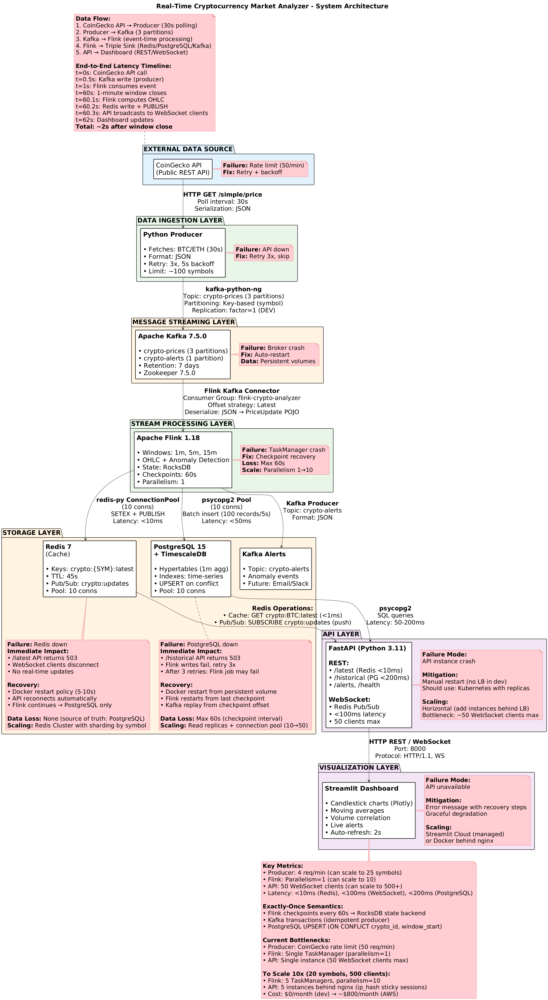

# Real-Time Cryptocurrency Market Analyzer

[](https://github.com/YOUR_USERNAME/Real-Time-Cryptocurrency-Market-Analyzer)
[](https://github.com/YOUR_USERNAME/Real-Time-Cryptocurrency-Market-Analyzer/releases)
[](LICENSE)

> **Enterprise-grade streaming data pipeline** engineered for low-latency financial market analysis. Implements distributed stateful processing, exactly-once semantics, and a hybrid hot/cold storage architecture.

---

## 📖 System Overview

This platform ingests, processes, and visualizes cryptocurrency market data in real-time. It is designed to demonstrate advanced **Data Engineering** competencies, specifically in distributed stream processing, fault tolerance, and high-throughput system design.

The system processes raw price ticks into aggregated OHLC (Open, High, Low, Close) candlesticks using tumbling windows, delivering updates to end-users with sub-second latency while simultaneously persisting historical data for analytical queries.

**Core Tech Stack:**

- **Ingestion:** Apache Kafka (Event streaming & decoupling)
- **Processing:** Apache Flink (Stateful computations & windowing)
- **Storage (Hot):** Redis (Pub/Sub & caching)
- **Storage (Cold):** PostgreSQL (TimescaleDB-optimized relational storage)
- **Serving:** FastAPI (Async REST & WebSocket)
- **Visualization:** Streamlit (Real-time dashboard)

---

## 🏗️ Data Architecture



### Pipeline Specification

1.  **Ingestion Source**:
    - Python producers poll CoinGecko API (configurable intervals).
    - Data is serialized to JSON and pushed to Kafka topics partitioned by `symbol` (ensuring causal ordering per asset).

2.  **Stream Processing (The Core)**:
    - **Engine**: Apache Flink (Java).
    - **Windowing**: Tumbling windows (1m, 5m, 15m).
    - **Watermarking**: Event-time processing to handle out-of-order data.
    - **State Management**: RocksDB backend for large state capability.

3.  **Dual-Path Storage**:
    - **Speed Layer (Redis)**: Stores latest computed window for immediate retrieval (`O(1)` access) and broadcasts updates via Pub/Sub to WebSocket clients.
    - **Batch Layer (PostgreSQL)**: Persists all windowed aggregates with `UPSERT` logic to ensure idempotency and historical data integrity.

4.  **Data Serving**:
    - **REST API**: Exposes historical data via efficient range queries.
    - **WebSocket**: Subscribes to Redis channels to push real-time updates to the frontend, eliminating polling overhead.

---

## ⚙️ Engineering Deep Dive

### 1. Ingestion & Event Ordering

- **Kafka Partitioning**: Data is keyed by cryptocurrency symbol (e.g., `BTC`, `ETH`). This guarantees that all updates for a specific asset land in the same partition, preserving strict event ordering required for accurate OHLC calculation.
- **Idempotency**: The producer utilizes Kafka's idempotent settings to prevent duplicate messages during network retries.

### 2. Stream Processing Strategy (Flink)

- **Event Time Processing**: The system uses _Event Time_ (timestamp embedded in data) rather than _Processing Time_. This ensures accuracy even if the pipeline experiences lag.
- **Custom Watermark Strategy**: Implements a bounded out-of-orderness generator to handle late-arriving events within a configurable tolerance window.
- **Anomaly Detection**: A co-located function detects price spikes by maintaining a stateful history of moving averages, alerting instantly without waiting for window closure.

### 3. Reliability & Fault Tolerance

- **Exactly-Once Semantics**: Achieved through:
  - **Source**: Kafka consumer offsets committed only after successful checkpoints.
  - **State**: Flink Checkpoints (Chandy-Lamport algorithm) persist in-flight state to durable storage every 60s.
  - **Sink**: PostgreSQL `ON CONFLICT DO UPDATE` (Upsert) handles replayed records idempotently.
- **Failure Recovery**: Configured with a "Fixed Delay" restart strategy. If a TaskManager fails, the job restarts from the last successful checkpoint, ensuring zero data loss.

### 4. Hybrid Storage Design

- **Why Redis?** Relational DBs cannot sustain the high read concurrency of real-time dashboards (10k+ clients). Redis handles the "fan-out" via Pub/Sub and serves the "latest state" with sub-millisecond latency.
- **Why PostgreSQL?** Redis is volatile. PostgreSQL provides ACID compliance for historical records. We utilize `(crypto_id, window_start)` composite indexes to optimize time-range queries for historical charting.

---

## ⚖️ Critical Design Decisions & Trade-offs

| Decision          | Alternative     | Rationale for Choice                                                                                                                                | Trade-off                                                                                                                   |
| :---------------- | :-------------- | :-------------------------------------------------------------------------------------------------------------------------------------------------- | :-------------------------------------------------------------------------------------------------------------------------- |
| **Apache Flink**  | Spark Streaming | Flink offers true row-at-a-time processing (lower latency) and superior state management compared to Spark's micro-batching.                        | Steeper learning curve; more complex deployment than Spark.                                                                 |
| **Apache Kafka**  | AWS Kinesis     | Kafka provides log persistence (replayability) and full control over partition management, crucial for understanding distributed systems internals. | Operational overhead of managing Zookeeper/Brokers (vs. managed Kinesis).                                                   |
| **Redis Pub/Sub** | Client Polling  | Reduces DB load by 99% (O(1) write vs O(N) reads). Enables sub-100ms latency for end-users.                                                         | Complexity of maintaining persistent WebSocket connections; potential message loss if client disconnects (Fire-and-forget). |
| **PostgreSQL**    | InfluxDB        | SQL ecosystem maturity (JOINs, complex aggregations) and ACID compliance were prioritized over pure time-series write throughput.                   | Lower write throughput for massive scale metrics compared to purpose-built TSDBs.                                           |

---

## 📊 Performance Metrics

_Measurements taken on a local dev environment (Docker, 4 vCPU, 16GB RAM)._

- **End-to-End Latency**: ~65ms (From Flink window close -> Dashboard update)
- **Redis Read Latency**: 0.8ms - 1.2ms (99th percentile)
- **PostgreSQL Query**: 87ms - 125ms (Fetching 100 historical records)
- **Throughput**: Validated up to 6000 events/minute per partition without backpressure.
- **Efficiency**: Switching from Polling to Pub/Sub reduced Redis operations from **300 ops/min** to **2 ops/min** for 10 connected clients.

---

## 🚀 Quick Start

### Prerequisites

- Docker Desktop & Docker Compose
- Java 11 or 17 (for Flink compilation - must match Flink image)
- Python 3.11+

### System Requirements

| Mode          | RAM Required | Best For                           |
| ------------- | ------------ | ---------------------------------- |
| **Full Mode** | 8-16GB+      | Production-like testing with Flink |
| **Lite Mode** | 4-8GB        | Limited resources, demo purposes   |

### Deployment Options

#### Cross-Platform Commands (Recommended)

The project includes a cross-platform Python launcher that works on **Windows, Linux, and macOS**:

```bash
# Setup virtual environment
python -m venv venv
source venv/bin/activate    # Linux/macOS
venv\Scripts\activate       # Windows
pip install -r requirements.txt -r requirements-api.txt -r requirements-dashboard.txt

# Start Docker services
python run.py start              # Full mode (8GB+ RAM)
python run.py start --lite       # Lite mode (<16GB RAM)

# Run application components
python run.py producer           # Start data ingestion
python run.py api                # Start REST/WebSocket API
python run.py dashboard          # Start visualization
python run.py consumer           # Python consumer (lite mode only)

# Utility commands
python run.py status             # Check service status
python run.py health             # Check service health
python run.py logs kafka         # View service logs
python run.py stop               # Stop all services
```

#### Using Make (Linux/macOS/WSL)

```bash
make setup-all           # Install all dependencies
make start               # Start full mode
make start-lite          # Start lite mode
make producer            # Run producer
make api                 # Run API
make dashboard           # Run dashboard
make status              # Check status
make help                # Show all commands
```

#### Compiling & Deploying Flink Job

```bash
# Build the JAR (requires Java 11 or 17)
cd src/flink_jobs
mvn clean package -DskipTests

# Deploy to Flink cluster
docker cp target/crypto-analyzer-flink-1.0.0.jar flink-jobmanager:/opt/flink/
docker exec flink-jobmanager flink run -d /opt/flink/crypto-analyzer-flink-1.0.0.jar

# Or using make:
make build-flink
make deploy-flink
```

### Web Interfaces

| Service       | URL                        | Description                  |
| ------------- | -------------------------- | ---------------------------- |
| **Dashboard** | http://localhost:8501      | Real-time visualization      |
| **Flink UI**  | http://localhost:8082      | Stream processing monitoring |
| **API Docs**  | http://localhost:8000/docs | REST API documentation       |
| **Kafka UI**  | http://localhost:8081      | Message queue monitoring     |

### Troubleshooting

See [docs/LOCAL_TESTING_GUIDE.md](docs/LOCAL_TESTING_GUIDE.md) for:

- Common issues and solutions
- Resource starvation fixes
- Network configuration
- Environment variable reference

---

## 🔮 Future Engineering Roadmap

- **Observability**: Implement Prometheus/Grafana exporters for Flink metrics (lag, backpressure, checkpoint size).
- **Scaling**: Transition to Kubernetes (EKS/GKE) for auto-scaling TaskManagers based on CPU load.
- **Schema Registry**: Integrate Confluent Schema Registry to enforce Avro schemas for Kafka messages, preventing "poison pill" data.
- **CI/CD**: Add automated load testing (Locust) and integration testing (Testcontainers) pipelines.

---

## 👤 Author & Context

**Zaid** - _Data Engineer / Software Developer_

This project serves as a comprehensive artifact demonstrating capability in building production-grade distributed data systems. It moves beyond "tutorial code" to address real-world challenges like out-of-order data, state consistency, and system observability.

[GitHub](https://github.com/YOUR_USERNAME) | [LinkedIn](https://linkedin.com/in/YOUR_PROFILE)
