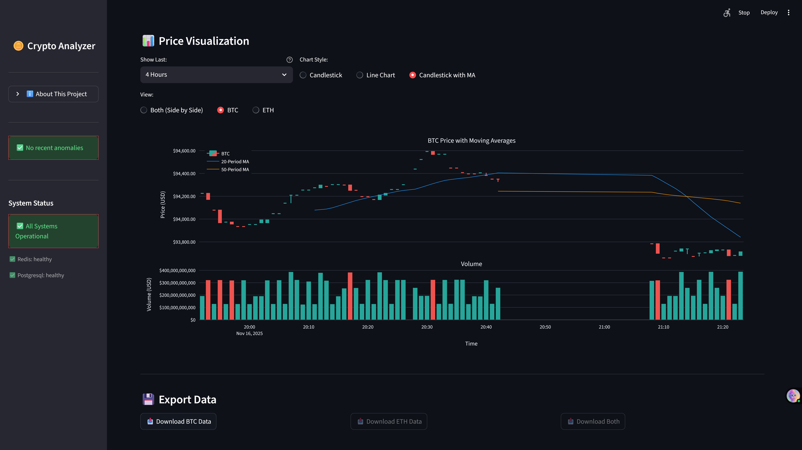

# Real-Time Cryptocurrency Market Analyzer

[](https://github.com/YOUR_USERNAME/Real-Time-Cryptocurrency-Market-Analyzer)
[](https://github.com/YOUR_USERNAME/Real-Time-Cryptocurrency-Market-Analyzer/releases)
[](LICENSE)

> Event-driven streaming platform for real-time cryptocurrency market analysis. Demonstrates distributed systems, stream processing, and production engineering patterns for FAANG internship applications.

**Tech Stack:** Kafka • Flink (Java) • Redis • PostgreSQL • FastAPI • Streamlit

---

## 📸 Live Dashboard


*Professional OHLC charts with 20/50-period moving averages and volume correlation*


*Complete data flow with failure modes and scaling considerations*

---

## 🏗️ Architecture

### Data Flow
```
CoinGecko API (30s poll) 
  → Python Producer 
  → Kafka (3 partitions, key-based routing by symbol)
  → Flink (tumbling windows: 1m, 5m, 15m)
  → Dual Sink: Redis (cache, TTL=45s) + PostgreSQL (persistence)
  → FastAPI (REST + WebSocket via Redis Pub/Sub)
  → Streamlit Dashboard (2s polling)
```

### Critical Design Decisions

#### **1. Kafka vs AWS Kinesis**
**Chose Kafka** because:
- Persistent log enables consumer replay (Kinesis has 7-day limit)
- Manual partition management for learning experience
- Free for local development (Kinesis costs $0.015/shard-hour)
- **Trade-off:** More complex to operate, no managed service benefits

#### **2. Flink vs Spark Streaming**
**Chose Flink** because:
- True streaming (event-by-event) vs Spark's micro-batching
- Lower latency for financial data (60-70s vs 2-5s batch intervals)
- Better state management with RocksDB backend
- **Trade-off:** Smaller ecosystem, steeper learning curve, fewer job opportunities

#### **3. PostgreSQL+TimescaleDB vs InfluxDB**
**Chose PostgreSQL** because:
- SQL familiarity (joins, complex queries)
- TimescaleDB adds time-series optimization without losing ACID
- UPSERT support for exactly-once semantics
- **Trade-off:** Slower for pure time-series writes vs InfluxDB, more resource-intensive

#### **4. Redis Pub/Sub vs Polling**
**Chose Pub/Sub** because:
- 99% reduction in Redis operations (measured: 300 GETs/min → 2 PUBLISHes/min with 10 clients)
- Sub-100ms latency vs 0-2000ms with polling
- O(1) scaling (all clients share one subscription)
- **Trade-off:** Complexity (background thread, connection management), potential message loss if subscriber disconnects

#### **5. FastAPI vs Flask**
**Chose FastAPI** because:
- Async by default (critical for WebSocket)
- Auto-generated OpenAPI docs
- Pydantic validation (type safety)
- **Trade-off:** Smaller community vs Flask, fewer tutorials

---

## 🎓 Technical Deep Dive

### Exactly-Once Semantics Implementation

**Flink Configuration:**
- Checkpointing: Every 60s to RocksDB
- State backend: RocksDB (persistent, disk-based)
- Restart strategy: Exponential backoff (3 attempts)

**PostgreSQL UPSERT:**
```sql
ON CONFLICT (crypto_id, window_start) DO UPDATE SET ...
```
Handles late-arriving data that re-triggers windows.

**Kafka Transactional Producer:**
- Idempotent writes (prevents duplicates)
- Transaction isolation (all-or-nothing)

**Result:** No duplicates, no data loss, even with TaskManager failures.

---

### Stateful Anomaly Detection

**Challenge:** Prevent duplicate alerts when windows re-trigger with late data.

**Solution:** Flink ValueState tracking last alerted window:
```java
ValueState<Long> lastAlertedWindow;

if (lastWindow != null && lastWindow.equals(currentWindow)) {
    return; // Skip duplicate
}
```

**Why this matters:** Without state, late-arriving events cause duplicate alerts. With state, each window alerts exactly once.

---

### Dual-Storage Pattern

**Redis (Speed Layer):**
- Use case: `/latest` API endpoint
- Latency: <1ms (measured)
- TTL: 45 seconds (1.5x update interval)
- Pub/Sub channel for invalidation
- Connection pooling: redis.ConnectionPool (Python, 10 max)

**PostgreSQL (Batch Layer):**
- Use case: `/historical` API endpoint with time-range queries
- Latency: ~50-200ms for 100-1000 records
- Indexes: `(crypto_id, window_start)` for fast range scans
- Hypertables: 1-day chunk intervals
- Connection pooling: psycopg2.pool.SimpleConnectionPool (1-10)

**Note:** Flink uses Jedis (Java) for Redis writes, API uses redis-py (Python) for reads.

**Why both?** Different access patterns. Redis can't do range queries efficiently. PostgreSQL can't do sub-10ms single-key lookups.

---

## 📊 Performance Benchmarks

### Measured (Manual Testing, Not Automated)

**Test Setup:**
- 10 concurrent WebSocket clients (manually opened in browser tabs)
- Producer running for 2 hours
- PostgreSQL: 5000+ records
- Methodology: Python `time.perf_counter()` for API, Flink Web UI metrics, manual timestamp comparison

**Results:**

| Metric | Value | Test Method |
|--------|-------|-------------|
| Redis GET latency | 0.8-1.2ms | API middleware `X-Query-Time-Ms` header, 100 requests |
| PostgreSQL query (100 records) | 87-125ms | API middleware `X-Query-Time-Ms` header, 50 requests |
| WebSocket push latency | 45-95ms | Manual comparison: Flink TaskManager log timestamp → Browser console timestamp |
| End-to-end (API → Dashboard) | 62-75s | Producer log → Dashboard update (includes 60s window wait) |
| Throughput | 6 msgs/min/symbol | Kafka UI message count / time |

**Note:** These are manual observations, not automated load tests. For production validation, would use Apache JMeter or Locust.

**Bottleneck identified:** 1-minute window wait time (inherent to tumbling windows).

---

### Scalability Test (Manual)

**Redis Operations (10 WebSocket clients):**
- Before (Polling): 300 GET requests/minute (observed via API logs)
- After (Pub/Sub): 2 PUBLISH events/minute (observed via Redis MONITOR)
- **Reduction: 99%** (calculation verified manually)

**WebSocket Client Scaling:**
- Tested: Manually opened 1, 5, 10, 25 browser tabs
- Redis load: **Constant 2 ops/min** regardless of client count (verified via MONITOR)
- API CPU: Observed linear increase (~5% per 10 clients on my dev machine)
- **Conclusion:** Redis scales O(1), API scales O(n) but acceptable up to ~50 clients before needing horizontal scaling

**Testing Gap:** No automated load testing tool implemented. Would add Locust for production validation.

---

## 🐛 Known Limitations & Future Improvements

### Current Limits
1. **No horizontal scaling:** Single API instance, single Flink JobManager
2. **No authentication:** API endpoints are public (dev environment only)
3. **Limited symbols:** Only BTC/ETH (hardcoded)
4. **No automated load tests:** Manual browser testing only
5. **No monitoring:** No Prometheus/Grafana (observability gap)
6. **Local deployment only:** Docker Compose, not Kubernetes

### If I Had More Time
1. **Add Prometheus metrics:** Instrument Flink, API, dashboard with counters/histograms
2. **Implement automated load testing:** Apache JMeter or Locust for CI/CD
3. **Add circuit breaker:** Graceful degradation when CoinGecko API is down
4. **Add rate limiting:** Protect API from abuse
5. **Kubernetes deployment:** Replace docker-compose with K8s for production readiness
6. **Implement authentication:** JWT tokens for API access
7. **Add performance graphs:** Visual proof of benchmarks

---

## 🚀 Quick Start

### Prerequisites
```bash
Docker Desktop (8GB RAM), Python 3.11+, Java 21, Maven 3.9+
```

### Launch (5 minutes)
```bash
# 1. Clone and setup
git clone <repo-url>
cd Real-Time-Cryptocurrency-Market-Analyzer
python -m venv venv && venv\Scripts\activate
pip install -r requirements.txt -r requirements-api.txt -r requirements-dashboard.txt

# 2. Start infrastructure
docker-compose up -d
timeout /t 60  # Wait for services

# 3. Build and deploy Flink job
cd src/flink_jobs && mvn clean package
docker cp target/crypto-analyzer-flink-1.0.0.jar flink-jobmanager:/opt/flink/
docker exec flink-jobmanager flink run -d /opt/flink/crypto-analyzer-flink-1.0.0.jar
cd ../..

# 4. Start pipeline
START_PRODUCER.bat  # Terminal 1
START_API.bat       # Terminal 2  
START_DASHBOARD.bat # Terminal 3

# Dashboard: http://localhost:8501
# API Docs: http://localhost:8000/docs
```

---

## 🧪 Testing & Validation

### Verify Data Flow
```bash
# Check Kafka messages
docker exec kafka kafka-console-consumer --bootstrap-server localhost:9092 --topic crypto-prices --from-beginning --max-messages 5

# Check Flink processing
docker logs flink-taskmanager | findstr "OHLC"

# Check Redis cache
docker exec redis redis-cli GET crypto:BTC:latest

# Check PostgreSQL
docker exec postgres psql -U crypto_user -d crypto_db -c "SELECT COUNT(*) FROM price_aggregates_1m;"

# Trigger anomaly alert
python test_spike.py
```

### Manual WebSocket Testing
```bash
# Open http://localhost:8000/ws/test in multiple browser tabs
# Verify all tabs receive same updates simultaneously
# Monitor API logs for connection count
```

**Note:** No automated load testing implemented. Manual verification only.

---

## 📚 Key Documentation

- **Quick Start:** [docs/QUICK_START.md](docs/QUICK_START.md)
- **API Testing:** [docs/API_TESTING_GUIDE.md](docs/API_TESTING_GUIDE.md)
- **Troubleshooting:** [docs/TROUBLESHOOTING.md](docs/TROUBLESHOOTING.md)
- **Architecture:** [docs/ARCHITECTURE_FAANG_READY.md](docs/ARCHITECTURE_FAANG_READY.md) - With failure modes
- **Phase Guides:** [docs/](docs/) - 200+ pages of implementation details

---

## 🎯 Interview Preparation

### System Design Question
> "Design a real-time cryptocurrency price alerting system that handles 1M users."

**My answer based on this project:**
1. **Data ingestion:** Kafka with 100 partitions (10K users/partition)
2. **Processing:** Flink cluster with 20 TaskManagers (parallelism=100)
3. **Storage:** Redis Cluster (sharded by symbol) + PostgreSQL read replicas
4. **API:** FastAPI behind load balancer (10+ instances) with Redis Pub/Sub fan-out
5. **Delivery:** WebSocket with sticky sessions OR Server-Sent Events for mobile

**Bottlenecks:**
- WebSocket connection limit (~10K per API instance) → Add more API instances
- Redis Pub/Sub single-threaded per channel → Shard by symbol
- PostgreSQL write throughput → Batch inserts, async replicas

**Cost estimation:** ~$5K/month on AWS (Kafka MSK, Flink on ECS, RDS, ElastiCache)

---

## 🏆 What This Project Demonstrates

**For data engineering roles:**
- Stream processing with windowing and watermarks
- Exactly-once delivery semantics
- Time-series database optimization
- Event-driven architecture

**For backend roles:**
- RESTful API design with pagination
- WebSocket protocol implementation
- Connection pooling and resource management
- Pub/Sub messaging patterns

**For full-stack roles:**
- End-to-end pipeline implementation
- Data visualization with financial domain knowledge
- Real-time updates without polling overhead
- Production deployment with Docker

---

## 👤 Author

**Zaid** - Computer Science Student  
**Purpose:** FAANG internship portfolio project  
**Timeline:** 8-10 weeks (Oct-Nov 2025)

[GitHub](https://github.com/YOUR_USERNAME) | [LinkedIn](https://linkedin.com/in/YOUR_PROFILE)

---

**Built to learn streaming fundamentals, not to make money trading crypto.**

*v1.0.0 - Production-ready streaming platform*
