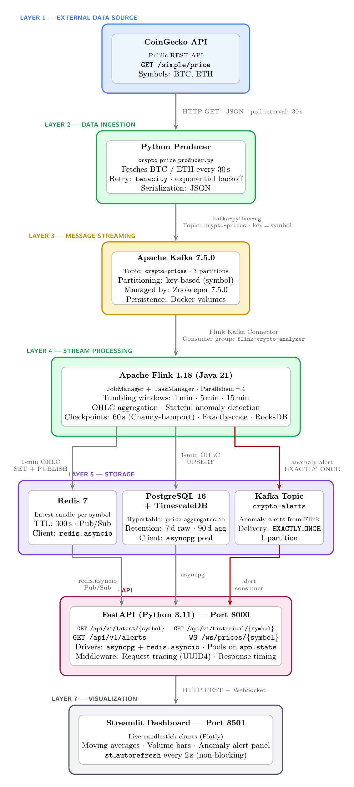

# Real-Time Cryptocurrency Market Analyzer

[](LICENSE)

A streaming data pipeline that ingests live cryptocurrency prices from the CoinGecko API, aggregates them into OHLC candlesticks using Apache Flink, and serves the results through a FastAPI backend and Streamlit dashboard.

Supports **BTC** and **ETH**. Runs entirely in Docker.

---

## Architecture


<!-- ```
CoinGecko API
     │
     ▼
Python Producer  (tenacity retry + exponential backoff)
     │
     ▼  Kafka topic: crypto-prices
     │
     ▼
Apache Flink  (Java, event-time, tumbling windows)
 ├─ 1-min OHLC  ──► PostgreSQL / TimescaleDB  (UPSERT)
 ├─ 1-min OHLC  ──► Redis  (latest candle, 300s TTL)
 ├─ 5-min OHLC  ──► stdout
 ├─ 15-min OHLC ──► stdout
 └─ Anomaly Detector  ──► Kafka topic: crypto-alerts
                               │
                               ▼
                          FastAPI alerts endpoint
     │
     ▼
FastAPI  (asyncpg + redis.asyncio, no blocking I/O)
 ├─ GET /api/v1/latest/{symbol}     ← Redis
 ├─ GET /api/v1/historical/{symbol} ← PostgreSQL
 ├─ GET /api/v1/alerts              ← PostgreSQL
 └─ WS  /ws/prices/{symbol}        ← Redis Pub/Sub
     │
     ▼
Streamlit Dashboard  (st_autorefresh every 2s)
``` -->

### Key implementation details

| Concern | Implementation |
|---|---|
| Retry / backoff | `tenacity` `@retry` with `wait_random_exponential`, replaces hand-rolled sleep loops |
| Flink checkpointing | Chandy-Lamport snapshots every 60 s, `EXACTLY_ONCE`, retained on cancellation |
| Flink state TTL | `AnomalyDetector` state expires after 1 h to prevent unbounded RocksDB growth |
| Kafka alert sink | `DeliveryGuarantee.EXACTLY_ONCE` (Flink-Kafka transactional integration) |
| PostgreSQL sink | At-least-once + idempotent `ON CONFLICT DO UPDATE` (same visible result) |
| Async API drivers | `asyncpg` + `redis.asyncio`; connection pools stored on `app.state` via lifespan |
| TimescaleDB retention | Native `add_retention_policy` — 7 days for raw data, 90 days for aggregates |
| Dashboard refresh | `st_autorefresh` (non-blocking); `time.sleep + st.rerun` was removed |

---

## Prerequisites

- Docker Desktop with Compose (≥ v2)
- Python 3.11+
- Java 11 or 17 + Maven (only needed to rebuild the Flink JAR)

**Minimum RAM:** 8 GB allocated to Docker (JobManager: 2 GB, TaskManager: 1.7 GB, plus Kafka/PostgreSQL/Redis).

---

## Quick Start

### 1. Clone and configure

```bash
git clone https://github.com/YOUR_USERNAME/Real-Time-Cryptocurrency-Market-Analyzer.git
cd Real-Time-Cryptocurrency-Market-Analyzer

cp .env.example .env
# Edit .env — at minimum set POSTGRES_PASSWORD and PGADMIN_PASSWORD
```

### 2. Install Python dependencies

```bash
python -m venv venv
source venv/bin/activate          # Windows: venv\Scripts\activate
pip install -r requirements.txt \
            -r requirements-api.txt \
            -r requirements-dashboard.txt
```

### 3. Start the pipeline

```bash
bash scripts/start_pipeline.sh
```

This script: checks dependencies → loads `.env` → runs `docker-compose up -d` → waits for Kafka, PostgreSQL, and Redis to be healthy → starts the producer in the background.

### 4. Deploy the Flink job

A pre-built JAR is not included. Build it first:

```bash
cd src/flink_jobs
mvn clean package -DskipTests
cd ../..
```

Then deploy:

```bash
# Copy JAR into the running JobManager container
docker cp src/flink_jobs/target/crypto-analyzer-flink-1.0.0.jar \
    flink-jobmanager:/opt/flink/

# Submit the job
docker exec flink-jobmanager \
    flink run -d /opt/flink/crypto-analyzer-flink-1.0.0.jar

# Or via Make:
make build-flink
make deploy-flink
```

### 5. Start the API and dashboard

```bash
# In separate terminals:
make api           # FastAPI on :8000
make dashboard     # Streamlit on :8501
```

### 6. Stop / teardown

```bash
bash scripts/stop_pipeline.sh    # stops producer + Flink job + docker-compose stop
bash scripts/teardown.sh         # removes all containers and volumes (destructive)
```

---

## Web Interfaces

| Service | URL | Notes |
|---|---|---|
| Streamlit dashboard | http://localhost:8501 | Live charts, alerts, export |
| FastAPI docs | http://localhost:8000/docs | Interactive Swagger UI |
| Flink Web UI | http://localhost:8082 | Job graph, checkpoints, metrics |
| Kafka UI | http://localhost:8081 | Topic browser, consumer groups |
| pgAdmin | http://localhost:5050 | PostgreSQL query tool |

PostgreSQL is exposed on host port **5433** (not 5432) to avoid conflicts with local installs.

---

## API Endpoints

```
GET  /health                              Service health (Redis + PostgreSQL)

GET  /api/v1/latest/all                   Latest OHLC for BTC and ETH
GET  /api/v1/latest/{symbol}              Latest OHLC for one symbol

GET  /api/v1/historical/{symbol}          1-min candles, filterable by time range
GET  /api/v1/historical/{symbol}/stats    Min/max/avg/volume summary
GET  /api/v1/historical/{symbol}/latest   Most recent persisted candle

GET  /api/v1/alerts                       Recent anomaly alerts (all symbols)
GET  /api/v1/alerts/{symbol}              Alerts for one symbol

WS   /ws/prices/{symbol}                  Real-time stream via Redis Pub/Sub
```

All responses include `X-Process-Time-Ms` (middleware) and `X-Request-ID` (UUID4, for tracing).

---

## Environment Variables

Copy `.env.example` to `.env`. Required variables:

| Variable | Default in example | Notes |
|---|---|---|
| `POSTGRES_PASSWORD` | `change_me_in_production` | **Must be set** |
| `PGADMIN_PASSWORD` | `change_me_in_production` | **Must be set** |
| `POSTGRES_USER` | `crypto_user` | |
| `POSTGRES_DB` | `crypto_db` | |
| `POSTGRES_HOST` | `localhost` | `postgres` when inside Docker network |
| `POSTGRES_PORT` | `5433` | Host-side port |
| `REDIS_HOST` | `localhost` | `redis` when inside Docker network |
| `REDIS_PORT` | `6379` | |
| `KAFKA_BOOTSTRAP_SERVERS` | `localhost:9092` | `kafka:29092` inside Docker |
| `COINGECKO_API_KEY` | _(unset)_ | Optional; increases CoinGecko rate limits |
| `LOG_LEVEL` | `INFO` | |

---

## Make Targets

```bash
make setup-all      # Create venv and install all dependencies
make start          # docker-compose up (full mode)
make stop           # docker-compose stop
make status         # Container status
make health         # Service health checks
make logs           # Flink TaskManager logs
make producer       # Run Python producer
make api            # Run FastAPI (uvicorn)
make dashboard      # Run Streamlit
make build-flink    # mvn clean package
make deploy-flink   # Build + submit Flink job
make stop-flink     # Cancel running Flink job
make clean          # Remove containers, volumes, build artifacts
```

---

## Project Structure

```
.
├── configs/
│   ├── flink-conf.yaml          # Flink cluster configuration
│   └── init-db.sql              # TimescaleDB schema + retention policies
├── docs/                        # Operational guides (testing, commands, troubleshooting)
├── scripts/
│   ├── start_pipeline.sh        # Start everything with health checks
│   ├── stop_pipeline.sh         # Graceful shutdown
│   └── teardown.sh              # Full cleanup (destructive)
├── src/
│   ├── api/                     # FastAPI application
│   │   ├── database.py          # asyncpg + redis.asyncio pools (lifespan)
│   │   ├── endpoints/           # latest, historical, alerts, websocket
│   │   ├── middleware.py        # Timing (perf_counter) + request tracing (UUID4)
│   │   └── main.py
│   ├── consumers/               # (Reserved for future consumers)
│   ├── dashboard/               # Streamlit application
│   ├── flink_jobs/              # Java Maven project
│   │   └── src/main/java/com/crypto/analyzer/
│   │       ├── CryptoPriceAggregator.java   # Main job: OHLC + sinks + checkpointing
│   │       ├── functions/
│   │       │   ├── AnomalyDetector.java     # KeyedProcessFunction, State TTL
│   │       │   ├── OHLCAggregator.java
│   │       │   └── OHLCWindowFunction.java
│   │       ├── models/
│   │       └── sinks/
│   │           └── RedisSinkFunction.java
│   └── producers/
│       └── crypto_price_producer.py         # tenacity retry, Kafka producer
├── docker-compose.yml
├── requirements.txt             # Core + tenacity
├── requirements-api.txt         # FastAPI, asyncpg, redis
└── requirements-dashboard.txt  # Streamlit, plotly, streamlit-autorefresh
```

---

## Docs

Detailed guides are in [`docs/`](docs/):

| File | Contents |
|---|---|
| `LOCAL_TESTING_GUIDE.md` | Setup walkthrough, common errors, resource requirements |
| `TROUBLESHOOTING.md` | PostgreSQL/TimescaleDB setup postmortem and fixes |
| `API_TESTING_GUIDE.md` | curl examples for every endpoint |
| `FLINK_COMMANDS.md` | Flink CLI reference for job management and savepoints |
| `DOCKER_COMMANDS.md` | Docker Compose cheat sheet |
| `DATABASE_CONNECTIONS.md` | Connection strings for psycopg2, JDBC, redis-py, pgAdmin |
| `REDIS_TESTING_GUIDE.md` | Verifying the Redis caching layer |
