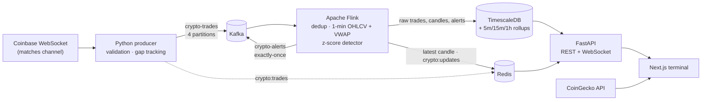

# Real-Time Cryptocurrency Market Analyzer

[](https://github.com/DiazSk/Real-Time-Cryptocurrency-Market-Analyzer/actions/workflows/ci.yml) [](LICENSE)

A streaming data pipeline that takes **every trade** for 8 crypto pairs from Coinbase's live feed, deduplicates it, rolls it up into 1-minute OHLCV candles in event time with Apache Flink, flags unusual price moves with a z-score detector, and serves the results to a Next.js market terminal over REST and WebSocket.

**Stack:** Python · Kafka · Apache Flink (Java) · TimescaleDB · Redis · FastAPI · Next.js · Docker Compose

**Tracks:** BTC, ETH, SOL, XRP, ADA, DOGE, AVAX, POL

## Results

All numbers are measured and reproducible. The pipeline numbers come from a 38-minute acceptance run. The load and chaos numbers come from `make load-test` and `make chaos-test`, run on an M-series MacBook (10 cores, 4 GB for Docker) with a single API process and the load generator on the same machine.

| What | Result |
|---|---|
| Trades ingested | 17,969, with 0 duplicates and 0 missed (checked with trade-ID gap tracking) |
| Candle correctness | 0 bad candles: every candle has `trade_count > 0` and `low ≤ VWAP ≤ high` |
| REST latency | p95 **12.8 ms** at 10 concurrent clients (1,640 req/s) and **460 ms** at 50 clients (329 req/s), 0 errors ([load results](benchmarks/results/2026-09-27-load.json)) |
| Live WebSocket fan-out | **400 clients** (the highest step tested), every one receiving the same trades as the best-served client (min delivery ratio 1.000), p95 exchange-to-client lag **166 ms** |
| Ingestion lag | p95 **92 ms** from the exchange's trade timestamp to the producer (the clock offset, 28 ms, is recorded) |
| Flink TaskManager crash | 0 lost trades, 0 inconsistent candles; data flowing again after 116 s ([chaos results](benchmarks/results/2026-09-27-chaos.json)) |
| Kafka broker restart | 0 lost trades; data flowing again after 5.5 s (one quick restart; a longer broker outage wasn't tested) |
| Postgres down for 30 s | 0 lost trades, 0 inconsistent candles; data flowing again 123 s after the fault |
| Redis down for 30 s | API 100% available (served from Postgres); live trades resumed 0.7 s after Redis came back in this run. The listener's reconnect backoff caps this at 30 s |
| Producer restart | 1 trade missed while it reconnected (Coinbase doesn't replay the feed) |
| Anomaly alert | Injected price jump detected at z = 63.3, written once to Postgres and once to Kafka (read_committed) |

Flink's restart backoff sets the recovery times. It starts at 10 s and doubles up to 2 min, and failures within the same hour keep it raised. The chaos run followed earlier test failures, so the TaskManager and Postgres recoveries hit the long end of that range. The Redis scenario found a real bug: the API's pub/sub listener died on redis-py's own `ConnectionError`, so live trades never came back after a Redis restart. It's now fixed and covered by a test.

The full acceptance log is in [the design spec](docs/superpowers/specs/2026-09-25-real-ingestion-and-correctness-design.md#acceptance-run-2026-09-26).

## Architecture


```mermaid
flowchart LR
    CB["Coinbase WebSocket<br/>(matches channel)"] --> P["Python producer<br/>validation · gap tracking"]
    P -->|"crypto-trades<br/>4 partitions"| K[(Kafka)]
    P -. "crypto:trades" .-> R
    K --> F["Apache Flink<br/>dedup · 1-min OHLCV + VWAP<br/>z-score detector"]
    F -->|raw trades, candles, alerts| TS[("TimescaleDB<br/>+ 5m/15m/1h rollups")]
    F -->|"latest candle · crypto:updates"| R[(Redis)]
    F -->|"crypto-alerts<br/>exactly-once"| K
    TS --> API["FastAPI<br/>REST + WebSocket"]
    R --> API
    API --> UI["Next.js terminal"]
    CG["CoinGecko API"] --> UI
```

- **Event time:** candles use the exchange's trade timestamp. Watermarks allow 2 s of out-of-order data and a 30 s idle timeout.
- **Dedup:** Flink keeps the last trade ID it has seen per symbol, and `raw_trades` also has a primary key.
- **Anomaly detection:** an EWMA z-score over 1-minute log returns. It needs 30 candles of warm-up and at least 5 trades per candle, and it fires at |z| > 4. The alert direction comes from the sign of the price move.
- **Live terminal:** the producer publishes each new trade to Redis so the UI's live line moves on every trade. Candles come from the database at 1m, 5m, 15m or 1h.

### Delivery guarantees

| Sink | How | Guarantee |
|---|---|---|
| `raw_trades`, `price_aggregates_1m`, `price_alerts` | JDBC writes with `ON CONFLICT` (insert-or-skip, or upsert) | Effectively once |
| Kafka `crypto-alerts` | Transactional `KafkaSink`, committed on each 30 s checkpoint | Exactly once (read_committed) |
| Redis latest value + Pub/Sub | `SETEX` + `PUBLISH` | At least once (clients dedupe) |

Checkpoints run every 30 s in exactly-once mode with RocksDB state. Deploys go through a savepoint (`make deploy-flink`), so a redeploy keeps the in-progress minute and the detector's state.

## Quick start

You need Docker with at least 8 GB of RAM, Python 3.12, Node 20+, and Java 11 or 17 with Maven.

```bash
cp .env.example .env                  # set POSTGRES_PASSWORD and PGADMIN_PASSWORD
make setup-all                        # Python venv + dependencies
bash scripts/start_pipeline.sh        # containers, Kafka topic, Coinbase producer
make build-flink deploy-flink         # build and submit the Flink job
make api                              # FastAPI on :8000
cd frontend && npm install && npm run dev   # terminal on :3000
```

To stop everything, run `bash scripts/stop_pipeline.sh`. Running `bash scripts/teardown.sh` also deletes the volumes.

**Lite mode (no Flink, low RAM):** `make start-lite`, then run `make producer`, `make consumer` and `make api`, each in its own terminal. A single Python consumer builds the same candles by recomputing each window from `raw_trades`. It is at-least-once and does not detect anomalies.

| Service | URL |
|---|---|
| Market terminal | http://localhost:3000 |
| API docs (Swagger) | http://localhost:8000/docs |
| Flink UI | http://localhost:8082 |
| Kafka UI | http://localhost:8081 |
| pgAdmin | http://localhost:5050 (Postgres is on host port 5433) |

## API

| Endpoint | Returns |
|---|---|
| `GET /api/v1/latest/{symbol\|all}` | Latest candle from Redis, falling back to Postgres (`X-Data-Source` header) |
| `GET /api/v1/historical/{symbol}?interval=1m\|5m\|15m\|1h` | OHLCV candles |
| `GET /api/v1/historical/{symbol}/stats` | 24 h low, high, average and volume |
| `GET /api/v1/trades/{symbol}?seconds=` | Recent raw trades (up to 300 s) |
| `GET /api/v1/alerts/{symbol\|ALL}` | Z-score alerts |
| `GET /api/v1/symbols`, `/trending` | Tracked symbols; biggest 24 h movers |
| `WS /ws/prices/{symbol\|ALL}` | Live `trade` and `price_update` frames |

The tracked symbols live in one place, the `cryptocurrencies` table. To add a pair, insert a row there and restart the producer and API.

## Tests and benchmarks

`make test` runs 94 pytest tests (producer, API, lite consumer, benchmark helpers and chaos safety) and 22 JUnit tests (deserializer, dedup, candle aggregator, anomaly detector). CI also runs the schema checks and the chaos-check SQL against a clean TimescaleDB.

`make load-test` (about 9 min) and `make chaos-test` (about 25 min) reproduce the numbers above against the local stack and write JSON results to [`benchmarks/results/`](benchmarks/results/). Each file records its conditions.

## Known limitations

- A minute with no trades produces no candle, because there is no gap-filling.
- `/trending` stays empty until about 24 hours of candles exist.
- The producer's Kafka client (`kafka-python-ng`) has no idempotent mode. Downstream dedup absorbs retried sends.
- This runs as a local topology with one Kafka broker and one TaskManager.
- REST throughput falls from 1,640 req/s at 10 clients to 280 req/s at 100, and p95 rises to 1.3 s. The cause hasn't been profiled yet. Likely suspects are the single API process, the asyncpg pool (`max_size=10`) and the load generator sharing the machine.
- Recovery after a Flink failure can take up to about 2 minutes, because of the exponential restart backoff.

## Repository layout

```
src/producers/     Coinbase → Kafka trade producer
src/flink_jobs/    Flink job (Java): dedup, candles, anomaly detector, sinks
src/consumers/     Lite-mode Python consumer
src/api/           FastAPI app (asyncpg, redis.asyncio)
configs/           TimescaleDB schema, continuous aggregates, Flink config
frontend/          Next.js 16 terminal (bklit charts, Tailwind v4, zod)
tests/             Python tests
docs/              Operational guides (API, Flink, Docker, troubleshooting)
```
