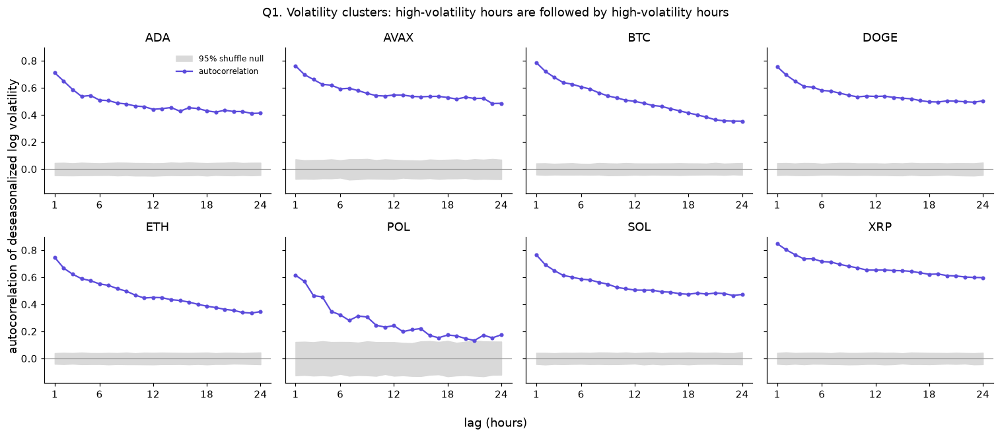
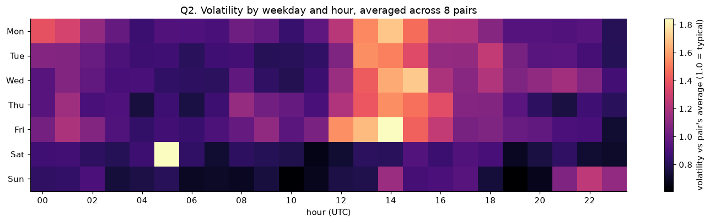
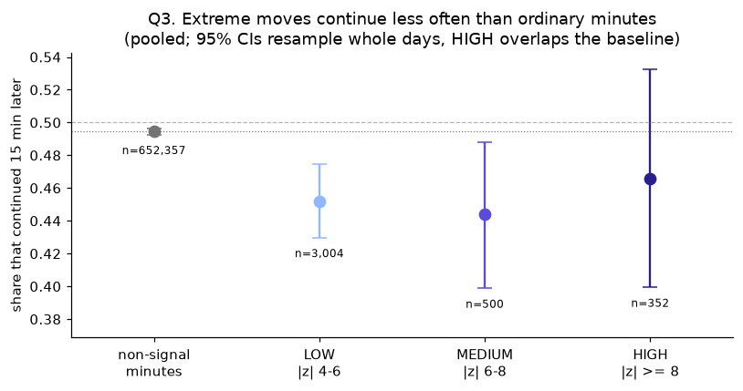
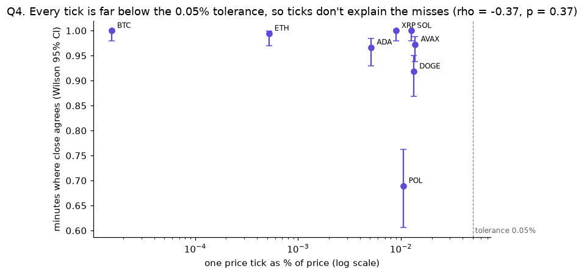

# Market analysis: four questions, answered with baselines

This analysis uses 911k one-minute candles for 8 Coinbase pairs (BTC, ETH, SOL, XRP, ADA, AVAX, DOGE and POL), covering 90 days from 2026-06-29 to 2026-09-27. The data comes from the [dbt marts](../analytics/).

- Every number below has a **95% confidence interval** and a **baseline or null hypothesis**.
- Minutes within a day aren't independent, so the intervals resample **whole days** (a block bootstrap).
- Null results are reported as null.

**Full method, code and tables:** [`market_analysis.ipynb`](market_analysis.ipynb)

> Descriptive market statistics for a data-engineering portfolio project. Not trading or investment advice.

## 1. Volatile hours follow volatile hours



- **Finding:** the lag-1 autocorrelation of hourly volatility is **0.76** (median across pairs; 0.61 to 0.85 per pair). That clears the 95% shuffle null for **all 8 pairs**; the null's upper bound is about 0.12.
- **Method:** each hour is first divided by its pair's average for the same UTC hour. This removes the daily rhythm, which on its own would make neighbouring hours look alike.
- **Caveat:** the correlation is still 0.17 to 0.60 at 24 hours. Volatility regimes last for days, not just hours.

## 2. Markets are busiest around 14:00 UTC



- **Finding:** volatility at the peak hour (**14:00 UTC**, just after the US market opens at 13:30 UTC) is **1.80x** the quietest hour (06:00 UTC), with a 95% CI of **[1.60, 1.99]**.
- **Test:** Kruskal-Wallis across the 24 UTC hours, Holm-corrected. The hour effect is significant for all 8 pairs.
- **Weekday vs weekend is inconclusive:** weekday hours are 1.26x as volatile as weekend hours, but the 95% CI of [0.98, 1.61] includes 1. Thirteen weeks aren't enough to tell.
- **Caveat:** each weekday-hour cell has only about 13 samples. Single bright cells, such as Saturday 05:00, are one-off events, not patterns.

## 3. Extreme moves continue less often than ordinary minutes



A **signal** here is a 1-minute move with |z| > 4. It's the SQL version of the pipeline's Flink detector.

- **Frequency:** **45.2%** of the 3,856 signals kept going the same direction 15 minutes later, 95% CI [42.9%, 47.4%]. The baseline, across all 652,357 scored minutes, is **49.5%**, 95% CI [49.3%, 49.7%]. The difference is **−4.2 points**, 95% CI [−6.5, −2.0].
- **Per pair:** the difference is significant in 3 of 8 pairs after Holm correction (BTC, ETH and XRP).
- **Size:** on average, the move is *not* measurably given back. The mean 15-minute return in the signal's direction is +2.1 bps, 95% CI [−1.6, +6.5]. So reversals happen more often than usual, but they aren't larger on average.
- **Caveats:**
  - Minutes with a zero return now or 15 minutes later are excluded on both sides, because on thin pairs a flat price would otherwise count as "reverted".
  - The HIGH severity group alone (n = 352) overlaps the baseline.

## 4. The streaming pipeline matches the exchange on liquid pairs



- **Finding:** these are minutes the stream built by itself. For **BTC, ETH, SOL and XRP**, the close price agrees with Coinbase's official candle on **99.5% to 100%** of minutes, and volume is within 5% on **90.2% to 95.7%**. That covers about 183 to 184 minutes per pair; the Wilson intervals are in the notebook.
- **A hypothesis ruled out:** tick-size rounding doesn't explain the close-price misses on thin pairs.
  - The largest price tick of any pair is **0.011%** of price, so a one-tick difference can never exceed the 0.05% tolerance.
  - The rank correlation between tick size and agreement is also not significant (ρ = −0.56, p = 0.15, 8 pairs).
- **Open question:** POL's close-price misses (31% of its minutes) remain unexplained.

## Reproduce

With the stack up and the backfill loaded:

```bash
make analysis
```

It rebuilds the dbt marts, then re-executes the notebook top to bottom, rewriting the charts and the findings cell. The random seed is fixed, so the numbers above reproduce exactly. The statistics helpers in [`stats.py`](stats.py) have known-answer tests in [`tests/analysis/`](../tests/analysis/).
