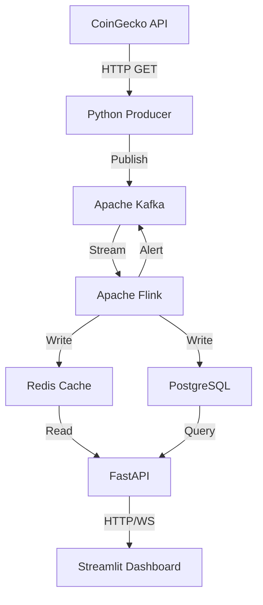

# Architecture Diagram - System Overview

## 🏗️ Complete System Architecture

```
┌─────────────────────────────────────────────────────────────────────────┐
│                         EXTERNAL DATA SOURCE                            │
│                                                                         │
│                    ┌────────────────────────┐                          │
│                    │    CoinGecko API       │                          │
│                    │  (Public Crypto Data)  │                          │
│                    └───────────┬────────────┘                          │
└────────────────────────────────┼──────────────────────────────────────┘
                                 │ HTTP GET /simple/price
                                 │ Every 30 seconds
                                 ↓
┌─────────────────────────────────────────────────────────────────────────┐
│                         DATA INGESTION LAYER                            │
│                                                                         │
│              ┌────────────────────────────────┐                        │
│              │   Python Producer              │                        │
│              │   crypto_price_producer.py     │                        │
│              │                                │                        │
│              │   • Fetches BTC/ETH prices     │                        │
│              │   • Enriches with metadata     │                        │
│              │   • Publishes to Kafka         │                        │
│              └────────────┬───────────────────┘                        │
└─────────────────────────────────┼──────────────────────────────────────┘
                                  │ kafka-python-ng
                                  │ Topic: crypto-prices (3 partitions)
                                  ↓
┌─────────────────────────────────────────────────────────────────────────┐
│                         MESSAGE STREAMING LAYER                         │
│                                                                         │
│         ┌────────────────────────────────────────────┐                │
│         │          Apache Kafka 7.5.0                │                │
│         │                                            │                │
│         │  Topic: crypto-prices                      │                │
│         │  • 3 partitions for parallelism            │                │
│         │  • Persistent message log                  │                │
│         │  • Offset-based consumption                │                │
│         │                                            │                │
│         │  Managed by: Apache Zookeeper 7.5.0        │                │
│         └────────────┬───────────────────────────────┘                │
└──────────────────────┼──────────────────────────────────────────────────┘
                       │ Flink Kafka Connector
                       │ Consumer Group: flink-crypto-analyzer
                       ↓
┌─────────────────────────────────────────────────────────────────────────┐
│                      STREAM PROCESSING LAYER                            │
│                                                                         │
│              ┌────────────────────────────────┐                        │
│              │   Apache Flink 1.18 (Java)     │                        │
│              │                                │                        │
│              │  ┌─────────────────────────┐  │                        │
│              │  │ CryptoPriceAggregator   │  │                        │
│              │  │                         │  │                        │
│              │  │ • Watermarks (10s lag)  │  │                        │
│              │  │ • 1-min tumbling windows│  │                        │
│              │  │ • 5-min tumbling windows│  │                        │
│              │  │ • 15-min tumbling windows  │                        │
│              │  │ • OHLC aggregation      │  │                        │
│              │  │ • Anomaly detection     │  │                        │
│              │  └─────────────────────────┘  │                        │
│              │                                │                        │
│              │  Checkpointing: Every 60s      │                        │
│              │  Semantics: Exactly-once       │                        │
│              │  State: RocksDB backend        │                        │
│              └────────────┬───────────────────┘                        │
└─────────────────────────────────┼──────────────────────────────────────┘
                                  │ Triple Output
                    ┌─────────────┼─────────────┐
                    ↓             ↓             ↓
         ┌──────────────┐  ┌──────────┐  ┌──────────────┐
         │    Redis     │  │PostgreSQL│  │  Kafka Topic │
         │   (Cache)    │  │(TimescaleDB) │ (Alerts)     │
         └──────┬───────┘  └─────┬────┘  └──────┬───────┘
                │                │              │
┌───────────────┼────────────────┼──────────────┼──────────────────────┐
│               │   STORAGE LAYER│              │                      │
│               │                │              │                      │
│    ┌──────────▼─────────┐  ┌──▼──────────────▼─────┐               │
│    │  Redis 7-alpine    │  │  PostgreSQL 15         │               │
│    │                    │  │  + TimescaleDB         │               │
│    │  Keys:             │  │                        │               │
│    │  crypto:BTC:latest │  │  Tables:               │               │
│    │  crypto:ETH:latest │  │  • price_aggregates_1m │               │
│    │                    │  │  • price_alerts        │               │
│    │  TTL: 300 seconds  │  │  • cryptocurrencies    │               │
│    │                    │  │                        │               │
│    │  Pub/Sub Channel:  │  │  Optimized:            │               │
│    │  crypto:updates    │  │  • Hypertables         │               │
│    │                    │  │  • Time-based indexes  │               │
│    └──────────┬─────────┘  └──────────┬─────────────┘               │
└───────────────┼────────────────────────┼──────────────────────────────┘
                │                        │
                │ Redis GET              │ SQL Query
                │ Redis SUBSCRIBE        │ JDBC Connection Pool
                ↓                        ↓
┌─────────────────────────────────────────────────────────────────────────┐
│                           API LAYER                                     │
│                                                                         │
│              ┌────────────────────────────────┐                        │
│              │   FastAPI Backend (Python)     │                        │
│              │                                │                        │
│              │  REST Endpoints:               │                        │
│              │  • GET /api/v1/latest/{symbol} │                        │
│              │  • GET /api/v1/historical/{symbol}                     │
│              │  • GET /api/v1/alerts/{symbol} │                        │
│              │  • GET /api/v1/stats           │                        │
│              │                                │                        │
│              │  WebSocket:                    │                        │
│              │  • WS /ws/prices/{symbol}      │                        │
│              │  • Event-driven (Pub/Sub)      │                        │
│              │  • <100ms latency              │                        │
│              │                                │                        │
│              │  Features:                     │                        │
│              │  • Connection pooling          │                        │
│              │  • Request tracing (X-Request-ID)                      │
│              │  • Performance headers         │                        │
│              │  • CORS middleware             │                        │
│              └────────────┬───────────────────┘                        │
└─────────────────────────────────┼──────────────────────────────────────┘
                                  │ HTTP REST / WebSocket
                                  │ Port: 8000
                                  ↓
┌─────────────────────────────────────────────────────────────────────────┐
│                       VISUALIZATION LAYER                               │
│                                                                         │
│              ┌────────────────────────────────┐                        │
│              │   Streamlit Dashboard          │                        │
│              │                                │                        │
│              │  Components:                   │                        │
│              │  • Live price cards            │                        │
│              │  • Candlestick charts (Plotly) │                        │
│              │  • Volume correlation bars     │                        │
│              │  • Moving average indicators   │                        │
│              │  • Alert notifications         │                        │
│              │  • Enhanced statistics         │                        │
│              │  • CSV data export             │                        │
│              │                                │                        │
│              │  Auto-refresh: 2 seconds       │                        │
│              │  Port: 8501                    │                        │
│              └────────────────────────────────┘                        │
└─────────────────────────────────────────────────────────────────────────┘
                                  ↓
                          User's Web Browser
```

---

## 📊 Data Flow Sequence

### 1. Price Ingestion (Every 30 seconds)
```
CoinGecko API
    ↓ HTTP GET
Python Producer
    ↓ Serialize to JSON
Kafka Topic: crypto-prices
```

### 2. Stream Processing (Continuous)
```
Flink Kafka Source
    ↓ Deserialize
Event-Time Watermarks (10s delay)
    ↓ Assign timestamps
Tumbling Windows (1m, 5m, 15m)
    ↓ Aggregate
OHLC Calculation + Anomaly Detection
    ↓ Parallel sinks
Redis (latest) + PostgreSQL (historical) + Kafka (alerts)
```

### 3. API Serving (On-demand)
```
Client Request
    ↓
FastAPI Endpoint
    ├─→ /latest → Redis GET → <10ms response
    ├─→ /historical → PostgreSQL query → <200ms response
    └─→ /ws → Redis Pub/Sub → Push updates instantly
```

### 4. Dashboard Display (Real-time)
```
Streamlit Auto-refresh (2s)
    ↓
API Client requests
    ↓
Process & format data
    ↓
Render Plotly charts
    ↓
Browser updates automatically
```

---

## 🔄 Event-Driven Update Flow

```
1. Flink completes 1-minute window
2. Flink writes OHLC to Redis: SETEX crypto:BTC:latest
3. Flink publishes to channel: PUBLISH crypto:updates {JSON}
4. API subscribed to channel receives event instantly
5. API broadcasts to all WebSocket clients (<100ms)
6. Dashboard polls API every 2s and updates UI
```

**Result:** Sub-second data propagation from Flink to browser!

---

## 💾 Storage Architecture

### Redis (Speed Layer)
```
Purpose: Latest price cache
Access Pattern: O(1) key-value lookup
Latency: <1ms
TTL: 5 minutes (auto-expire stale data)
Use Case: Dashboard current prices
```

### PostgreSQL + TimescaleDB (Persistence Layer)
```
Purpose: Historical time-series data
Access Pattern: Range queries with indexes
Latency: <100ms for 1000 records
Retention: Unlimited
Use Case: Historical charts, statistics
```

### Dual-Sink Benefits
- ✅ Redis serves real-time dashboard needs
- ✅ PostgreSQL serves analytical queries
- ✅ If Redis fails, pipeline continues (fault isolation)
- ✅ Optimized for different access patterns

---

## 🎯 Performance Characteristics

### Latency Breakdown

```
Producer → Kafka:           ~5ms    (network + serialization)
Kafka → Flink:              ~10ms   (deserialization)
Flink Window:               60s     (1-minute tumbling window)
Flink → Redis:              ~5ms    (cache write)
Flink → PostgreSQL:         ~20ms   (batch insert)
Redis → API:                <1ms    (GET operation)
PostgreSQL → API:           <100ms  (indexed query)
API → Dashboard:            ~50ms   (JSON serialization)
──────────────────────────────────────────────────
Total (Producer → Dashboard): ~60-70 seconds
```

### Throughput

```
Price Updates:    1 per 30 seconds per symbol = 2/minute
OHLC Windows:     1-min: 2/min, 5-min: 0.4/min, 15-min: 0.13/min
Alerts:           Variable (only when anomaly detected)
API Requests:     Unlimited (cache-based, no DB load)
WebSocket Clients: Scales to thousands (O(1) Redis subscription)
```

---

## 🔧 Component Responsibilities

| Component | Responsibility | Technology | Output |
|-----------|---------------|------------|--------|
| **Producer** | Data ingestion | Python | Kafka messages |
| **Kafka** | Message buffering | Apache Kafka | Persistent log |
| **Flink** | Stream processing | Java | OHLC candles, alerts |
| **Redis** | Fast caching | Redis | Latest prices |
| **PostgreSQL** | Historical storage | PostgreSQL + TimescaleDB | Time-series data |
| **API** | Data serving | FastAPI | REST + WebSocket |
| **Dashboard** | Visualization | Streamlit + Plotly | Interactive UI |

---

## 🎨 Creating a Visual Diagram

### Tools You Can Use

**Option 1: Draw.io (Recommended)**
1. Go to: https://app.diagrams.net/
2. Create new diagram
3. Use the ASCII art above as reference
4. Use shapes: Rectangles (components), Arrows (data flow)
5. Color code: Blue (data sources), Green (processing), Orange (storage), Purple (API/UI)
6. Export as PNG: `architecture-diagram.png`
7. Save to: `docs/screenshots/`

**Option 2: Lucidchart**
- Similar to Draw.io
- More professional templates
- Free tier available

**Option 3: Excalidraw**
- Hand-drawn style diagrams
- Modern aesthetic
- Open source

**Option 4: Mermaid (Code-based)**


### Diagram Best Practices

**Include:**
- ✅ All 7 technologies
- ✅ Data flow arrows with labels
- ✅ Port numbers
- ✅ Key operations (GET, PUBLISH, Query)
- ✅ Latency annotations
- ✅ Color coding by layer

**Make it:**
- ✅ Clear and uncluttered
- ✅ Left-to-right or top-to-bottom flow
- ✅ Consistent icon/shape usage
- ✅ Readable at different sizes
- ✅ Professional color palette

---

## 📐 Recommended Layout

```
Data Source Layer (Top)
    ↓
Ingestion Layer
    ↓
Message Queue Layer  
    ↓
Processing Layer
    ↓
Storage Layer (Redis + PostgreSQL side-by-side)
    ↓
API Layer
    ↓
Visualization Layer (Bottom)
```

---

**Save final diagram as:** `docs/screenshots/architecture-diagram.png`

**Add to README:** Replace the ASCII art with ``
